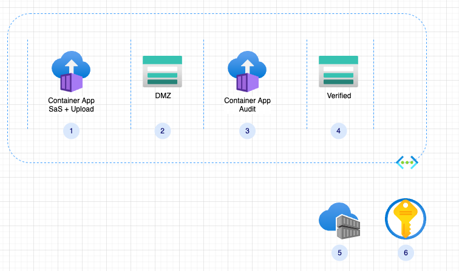

# file-service-sample

With the first version, we provide bear minimal capabilities for customers who needs to support the following user stories.
The suggested architecture, detailed shortly, also calls for an audit or scaning capabilities that would ensure the uploaded files are safe before moving them to the secured area, as all files uploaded should be treated as un-safe.

## User stories

As a service provider, I need my customers to uploaded content in a secured, easy to maintain micro-service exposed as an API, so that I can process the content uploaded and perform an action on it.

As a service provider, I would like to enable download of specific files for authorized devices or humans, so that they could download the content directly from storage.

As a service provider, I would like to offer my customers ability to see what files they have already uploaded, so that they can download it when needed with time restricted SaS.

## Design Approach

The following guidlines were considered for the solution approach:

- Network Seperation
- Time, role and IP based authorization
- Microservice

> Note, the IP restriction is provided as an ability, it does provide minimal layer of security, limiting the reuse of the same SaS by multiple users, for machine2machine communication, it would be better to authenticate the requests and have the time restriction shorter, for example having it as 30 seconds or less.

Here is the draft architecture created:


### Components

> To Do: add network security components and description

1. Container App - create SaS tokens and containers, it also provide SaS for given file with in a given container.

2. Storage Account - DMZ, all content is considered unsafe

3. Container App - verify content and move it to verified storage

4. Verified storage, content is assumed to be verified and has minimal or no threat to the organization

5. Container Registry - holds the container app images

6. Azure KeyVault - holds connection strings and other secured configuration

### Flow

>To DO: missing authentication

1. Caller<sup>1</sup> make a call to obtain a SaS token for a container<sup>2</sup>

2. ContainerApp, extracts the caller IP, creates the token, and return it to the caller

3. Caller uses the token to upload new file to the container in the DMZ storage

4. Second container app, validates the file uploaded is valid/clean and moves it to a verified storage account

<sup>1</sup> -  A caller is an authorized application, user or any other identity, the project has few sample clients that are able to leverage the provided APIs, it is an implementation decsion which client to use.

<sup>2</sup> - There are two options, either the caller provided an exisiting container name, or he can create a new one.

> Note: The scope of this project does not address how the content is validated/verified/cleaned.

## Main Design Considerations

- Secured, the code must hosted in vnet enabled compute.
- Youd storage must not be publicly exposed.
- All uploads are considered unsafe unless verified.
- Customer uploads must land on DMZ storage, with minimal, automatic clean up.
- Use .net6 as programing langauge
- Use Container Apps as the compute service

## File Server

We provide a few end-points, if the client did not create yet a designated container, he can call the `api/SaSToken` this will create a container with GUID as the name, and return a SaS token for that container. It is expected that the client will reuse this container in any consequtive calls. It will be implemented a validation for this.

### SaSToken

Provides SaS token, bsed on time restriction defined in configuration. We created default implementation that also allows for IP restriction based on the caller IP.

#### Get

Create a container and respond with the SaS token with permissions to create new blobs.

#### Get by Container

Gets a SaS token for given container with permissions to create new blobs.

#### Get by Container/File

Gets a read SaS token for the provided container and file path.

### Files

#### Get Container Files

Return the list of files within a given container.

### Request

The request can contain the designated container name, or if one is not passed, one would be created.

Here are two examples, the first is using a created container name, the second is requesting to create one.

```curl
curl -X 'GET' \
  'https://fileserver.grayriver-46b04276.northeurope.azurecontainerapps.io/api/SaSToken/f7b969a1-e800-424a-b9c1-ab6f94e49b6d' \
  -H 'accept: text/plain'
```

```curl
curl -X 'GET' \
  'https://fileserver.grayriver-46b04276.northeurope.azurecontainerapps.io/api/SaSToken' \
  -H 'accept: text/plain'
```

#### test.rest

As part of this repo, I've included the [rest.test](./clients/rest/test.rest) to help test uploading content to the DMZ storage.
You will need to create an `.env` file with these entries, both are provided with in the response of the Token API.

```.env
sas_base_url=<SasTokenBaseUri>
sas_sig=<SasTokenSig>

```

### Response

As part of the response, the full URI is provided together with the captured IP, the container name and also the breakdown of the URI which might be needed for few clients.

Here is a sample response:

```json
{
    "ContainerName":"xxx969a1-e800-424a-b9c1-ab6f94e49xxx",
    "RemoteIp":"XX.XXX.XX.XXX",
    "RequestStatus":"Success",
    "SaSUri":"https://xxxxxxx.blob.core.windows.net/f7b969a1-e800-424a-b9c1-ab6f94e49b6d?sv=2021-08-06&se=2022-09-05T14%3A17%3A51Z&sip=xx.xxx.xx.xxx&sr=c&sp=racwdxyltmei&sig=XXXXXXX",
    "SasTokenBaseUri":"https://xxxxxxx.blob.core.windows.net/f7b969a1-e800-424a-b9c1-ab6f94e49b6d","SasTokenSig":"sv=2021-08-06&se=2022-09-05T08%3A24%3A10Z&sip=xx.xxx.xx.xxx&sr=c&sp=racwdxyltmei&sig=XXXXXXX"
}
```
